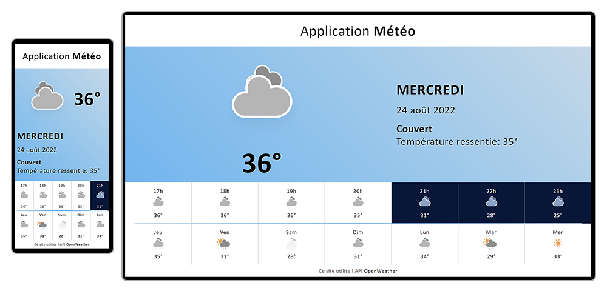

# Application Météo

Une application météo utilisant les données de l'API [OpenWeather](https://openweathermap.org/).

Documentation de l'API disponible sur le site d'[OpenWeather](https://openweathermap.org/api/one-call-3)

L'utilisation de l'API nécessite une clé (obtenable gratuitement en créant un compte sur OpenWeather)

Les paramètres de l'API peuvent être configuré à l'aide de la constante API_PARAM

```
const API_PARAM = {
    appid : '', // votre clé d'API
    lang: 'fr', // langage
    exclude: 'minutely', // information à exclure
    units: 'metric', // unité utilisée
    lat: 0, 
    lon: 0
}
```

Le délai de rafraichissement des informations peut être configuré a l'aide de la constante **REFRESH_DELAY**

